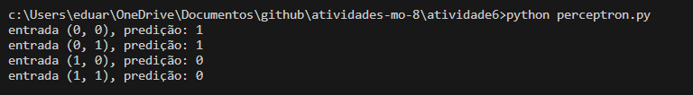

## Atividade Ponderada em sala de aula 

O objetivo desta atividade é criar um percepetron que reproduz o comportamento das portas lógicas : and, or, nand e xor. 

### Como configurar a solução 

Após já ter clonado o repositório e estando com o terminal aberto na pasta raíz 

1 Instalar a biblioteca numpy

```
pip install numpy
```

Pronto, o projeto já está configurado.

### Como utilizar a solução 

Após realizar a configuração já é possível utilizar a solução com o seguinte comando. 

```
# Não se esqueça de estar na raíz do projeto
python percepton.py
```

Pronto, agora o programa retorna o resultado de todas as portas lógicas possíveis no terminal. 

### Funcionamento da solução 

Entradas que o modelo recebe : 

```
print(f"entrada (0, 0), predição: {perceptron.predict([0, 0])}")
print(f"entrada (0, 1), predição: {perceptron.predict([0, 1])}")
print(f"entrada (1, 0), predição: {perceptron.predict([1, 0])}")
print(f"entrada (1, 1), predição: {perceptron.predict([1, 1])}")
```

Quais são as predições feitas pelo modelo : 




#### Explicação do resultado 

O objetivo do perceptron é dizer se algo é verdadeiro (1) ou falso (0). Neste caso, o objetivo foi treinar o modelo para descobrir a porta lógica AND. 

De tal modo que, como observado na imagem acima. Os dois primeiros casos retornam 1 e os dois últimos retornam 0. 
Assim, as seguintes entradas representam a porta AND. 

```
entrada (0, 0), predição: 1
entrada (0, 1), predição: 1
```
Já os próximos casos a predição foi negativa, podendo ser outro tipo de porta lógica. 

```
entrada (1, 0), predição: 0
entrada (1, 1), predição: 0
```
