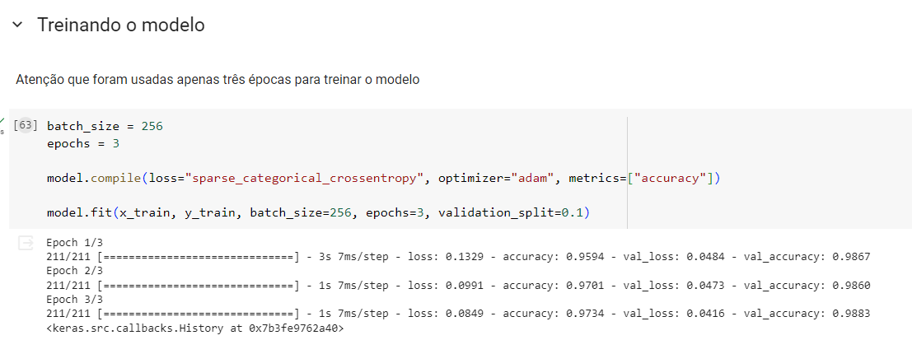
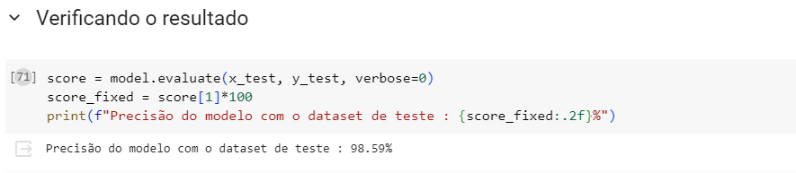

## Atividade Ponderada 7

O objetivo desta atividade é criar uma rede neural convolucional que foi treinada para descobrir números do dataset MNIST

### Como configurar a solução 

Só é necessário instalar as seguintes bibliotecas 
<code>
- numpy
- keras 
- pandas
- matplotlib
</code>


### Como utilizar a solução 

Após realizar a instalção das bibliotecas é possível interagir com o notebook jupyter e ter acesso a todo código. 
O mesmo está na pasta raíz do projeto e chama se CNN_MNIST.ipynb.


### Arquitetura da Rede Neural 

A rede neural foi projetada com base no modelo fornecido pela própria documentação do Keras. O código desenvolvido foi o seguinte : 

``` python
model = keras.Sequential(
    [
        keras.Input(shape=input_shape),
        layers.Conv2D(32, kernel_size=(3, 3), activation="relu"),
        layers.MaxPooling2D(pool_size=(2, 2)),
        layers.Conv2D(64, kernel_size=(3, 3), activation="relu"),
        layers.MaxPooling2D(pool_size=(2, 2)),
        layers.Flatten(),
        layers.Dropout(0.5),
        layers.Dense(10, activation="softmax"),
    ]
)

model.summary()
```

O objetivo desta rede neural é pegar as imagens do dataset MNIST e entender quais são os números. Assim, cada linha de código tem um motivo específico

1 - Aqui é definido o formato de input da rede neural que é uma imagem de 28x28 em escala de tons de cinza.
``` python
keras.Input(shape=input_shape)
```

2- Aqui são criados 32 mapas de características das imagens, a função relu serve para aumentar a não linearidade .
``` python
layers.Conv2D(32, kernel_size=(3, 3), activation="relu")
```
 
3- Aqui é feito a diminuição dos mapas de características pela metade. O objetivo é obter as características mais importantes de cada imagem.  

``` python
layers.MaxPooling2D(pool_size=(2, 2))
```

4 - Essa etapa de criação do mapa de características e logo em seguida a diminuição da dimensionalidades é aplicada novamente na rede neural nas seguintes linhas. 

``` python
layers.Conv2D(64, kernel_size=(3, 3), activation="relu"),
layers.MaxPooling2D(pool_size=(2, 2))
```

5- Aqui o vetor bidimensional é convertido em unidimensional.Assim, os dados são preparados para serem utilizados na rede neural

``` python
layers.Flatten()
```

6- Aqui é feito uma randomização onde o valor de várias unidades de input é definido como zero. De tal modo que a rede neural precisa aprender características mais robustas e evita overfitting

``` python
layers.Dropout(0.5)
```

7- Nesta é feito a última camada da rede neural. Nela é que são feitas as dez classes que representam cada número do dataset de zero a nove. A função de ativação softmax normaliza o output do modelo permitindo ele retornar a probabilidade de ser cada uma das dez classes disponíveis. 

``` python
layers.Dense(10, activation="softmax")
```


### Funcionamento da solução 

Como foi realizado apenas o treinamento da rede neural, não há um vídeo nesta etapa. 

Porém, segue algumas métricas importantes .

Na imagem abaixo é possível ver que o modelo foi treinado usando apenas três épocas.


Por último, mas não menos importante. O modelo obteve uma precisão de 98%.



